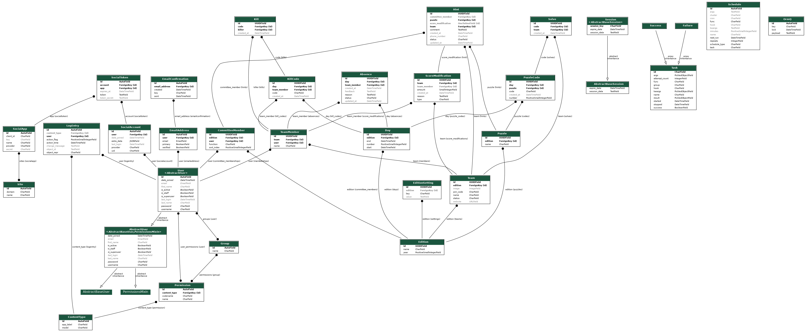

# Database design

## Libraries
This database design diagram includes models from Django and Django libraries. The Pandora database models can be found in the center of the diagram.

- Django (left)
    - `AbstractBaseSession`
    - `AbstractBaseUser`
    - `AbstractUser`
    - `ContentType`
    - `Group`
    - `LogEntry`
    - `Permission`
    - `PermissionsMixin`
    - `Session`
    - `Site`
    - `User`
- Django All Auth (left)
    - `EmailAddress`
    - `EmailConfirmation`
    - `SocialAccount`
    - `SocialApp`
    - `SocialToken`
- Django Q (right)
    - `Failure`
    - `OrmQ`
    - `Schedule`
    - `Success`
    - `Task`
